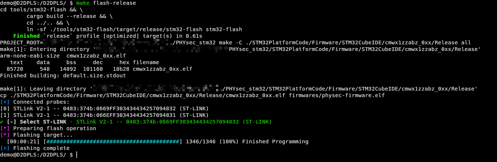
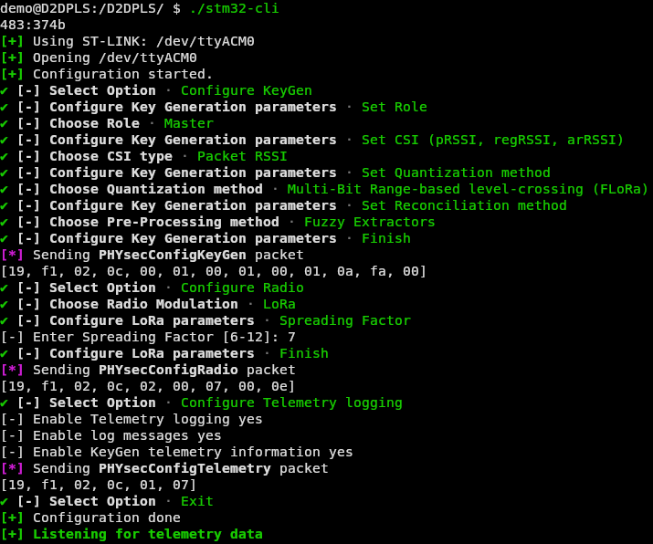

# README

## Repository structure

- `STM32PlatformCode` : workspace containing the project, driver code, etc.
- `tools/stm32-cli` : Rust tool for configuring the board using Serial line (UART)
- `tools/stm32-flash` : Rust tool for flashing the board using STLINK
- `tools/log-analyzer`: Rust tool that takes one or a couple of PLSKG experiment's log, and returns metrics from those experiments.


## Building & Flashing the board

The `Makefile` provided in the current directory allow building & flashing
STM32 firmware from command line without using `STM32CubeIDE`.

### Building

#### Building Without STM32CubeIDE
You can simply build by running from the root of the repository the command `make -j N (release|debug)`, eg. "make -j 4 release" to build in parallel on 4 cores.
You will need these dependencies:

- libudev-dev
- libclang-dev
- clang
- pkg-config
- make (install build-essentials meta-package for your distro)

and of course a recent Rust, for example with [rustup](rustup.rs): `curl --proto '=https' --tlsv1.2 -sSf https://sh.rustup.rs | sh`


To build the firmware, run one of the following commands:


```bash
# build release, debug firmwares and all the rusttools
make all
# build release and debug versions
make all-firmware
# build release
make release 
# build debug
make debug

# common compile command (clean + faster compilation)
make clean-release; make release -j
```

You can list all the available targets by running the following command 
(or just open the Makefile):
```bash
make list-targets
```

*NB: The Makefile is enough for building the project in its current state. You can see the different makefiles generated by STM32CubeIDE and customized by us if you want to get a grasp on how it's working, especially at ./STM32PlatformCode/Firmware/STM32CubeIDE/cmwx1zzabz_0xx/(Debug|Release)/Application/App/subdir.mk. You most likely want to add a target there if you are adding new files.

#### Reconfigure STM32CubeIDE project

If you ever need to do something that you can't do in any other way, you can reconfigure the project using STM32CubeIDE. Note that it will require you to spend time removing every hardcoded path if you do this and still want to be able to run the project right after cloning it.

1. Open the project in STM32CubeIDE
2. Add source location to project folder `STM32CubeIDE/cmwx1zzabz_0xx` 
    - `Right-click->Properties->C/C++ General->Paths and Symbols->Source Location->Link Folder` (Select `Link to folder in the file system`), fill with path (likely `../../SubGHz_Phy/App/libphysec`), this will set the `libphysec` folder as a source location for the current configuration.
    - Change active configuration in the `Source Location` window, then click `Add Folder->libphysec`, repeat for other configurations
3. If you notice that the issue comes from a file in `SubGHz_Phy/App/` not being linked by the IDE
    - `Right-click->Properties->C/C++ Build->Settings->Tool Settings->MCU GCC Linker->Miscellaneous->Additionnal object files`, add `.c` files missed by linker

If you cannot compile from Makefile:
1. Remove `Release` and `Debug` folders content, note that will probably require you to manually include used HAL.
    ```bash
    # from the project root
    rm -rf STM32CubeIDE/cmwx1zzabz_0xx/Debug/*
    rm -rf STM32CubeIDE/cmwx1zzabz_0xx/Release/*
    ```
2. Rebuild the project from the IDE (right click on the project, then clean, then build)
    - you need to rebuild for each configuration

## Tooling
tools below are located in the `tools` directory.
### Flashing

The `probe-flash-stm32` directory contains a `rust` tool which allows flashing
**STM32 devices** which embeds an *STLINK*.

It only needs an `ELF` file containing the firmware code (this is a file generated by STM32 build system as `<project_name>.elf` in the `Debug` or `Release` folders of the project (from the project root: `./STM32CubeIDE/cmwx1zzabz_0xx/<Debug|Release>` in our case)

#### Configure udev rules

```bash
sudo groupadd plugdev
sudo groupadd dialout
sudo usermod -aG plugdev,dialout $USER
# logout and login back 

wget https://probe.rs/files/69-probe-rs.rules
sudo mv 69-probe-rs.rules /etc/udev/rules.d/
sudo udevadm control --reload
sudo udevadm trigger
```


```bash
cd probe-flash-stm32
cargo b --release
cargo r -- -e <elf_file>
```


The tool look for available probes and detects *STLINK* devices. If multiple
devices are connected, the user is prompted to select the target device.

A symbolic link `stm32-flash` (pointing to `./tools/stm32-flash/target/release/probe-flash-stm32`) allows using the tool directly from the Makefile.

```bash
# flash debug build 
make flash-debug
# flash release build 
make flash-release
# flash arbitrary firmware
make flash FLASH_FILE=/path/to/firmware.elf
```

*NB: The tool need to be built in `release` mode before using the symbolic link (otherwise, the symlink will likely be broken).*
### Adding a new source file
When adding a new source file, you need to do two different things (and do those two different things two times, one for Debug one for Release). Let's assume we are at the root of the STM32 project (SubGHz\_Phy\_Quantization):

1) First, create a new target in the STM32CubeIDE/cmwx1zzabz\_0xx/(Debug | Release)/Application/App/subdir.mk. To do this, first add it to C\_SRCS, then to OBJS and finally to C\_DEPS. Now you can create the target. You should be able to easily copy what's already done for the other files.
2) Then, add the output to the object list at STM32CubeIDE/cmwx1zzabz\_0xx/(DEBUG | Release)/objects.list

The first steps creates the obj file for the added sources, the second one links the obj file to the firmware (this step happens in STM32CubeIDE/cmwx1zzabz\_0xx/(Debug | Release)/makefile).



### Configuring

The `stm32-cli` directory contains another tool (`Rust` again) which allows configuring the board using a simple command line interface.

It allows:
- Configuring PHYsec key generation procedure (using config file or manual config via menu)
    - Role
    - Algorithms 
    - CSI type 
- Configuring Telemetry
- Configuring Radio (LoRa SF, BW, tx power)
- Loading CSI values to the board
- Monitor Telemetry logging (optionnaly save telemetry data to files)

The tool reset the board on configuration. Alternatively, you can only monitor the telemetry data without resetting the board.

You should be able to figure out how to use the tool by looking at the help.
```bash
./stm32-cli  # if at the root of the repository
cargo r --release  # if in the tools/log-analyzer directory
```



### Analyzing the logs
The `log-analyzer` tool allows you to take two log files (Alice and Bob logs) or one single file (either Alice or Bob logs) from an experiment and extract meaningful metrics.

### Alternative solution: Docker

If you can't achieve to build/use the tool on your system, you can use docker instead.

Use the following commands to build the container and run the tools through it.
```bash
# build container
docker build -t physec-stm32 .

# run flashing tool
docker run --privileged --rm -i -v ./path/to/firmware:/root/firmware.elf  -t physec-stm32 ./stm32-flash -e firmware.elf
docker run --privileged --rm -i -t physec-stm32 # flashing is default command (physec-firmware.elf
                                                # is copied into the container dir `/root`

# run configuration tool
docker run --privileged --rm -i -t physec-stm32 ./stm32-config -l -R 

# run configuration tool with config file
docker run --privileged --rm -i -v ./path/to/config.toml:/root/config.toml physec-stm32 ./stm32-config ./config.toml -l -R
```

Due to impossibility for using udev in docker, you need to run the container in **privileged** mode and connect **only one** STM32 device to your computer.

## Implementation

We use the STM32 LRWAN expansion package which ship:
- Projects skeletons
    - `./STM32PlatformCode/Firmware/SubGHz_Phy/`
- Drivers & HAL code  
    - `./STM32PlatformCode/Drivers/`
- Radio drivers
    - `./STM32PlatformCode/Middlewares`
- Firmware code
    - `./STM32PlatformCode/Firmware/SubGHz_Phy/App/`

### Project Files

The project architecture in the project folder is as follow:
- `SubGHz_Phy/App/`: Application code
- `STM32CubeIDE/cmwx1zzabz_0xx`: STM32CubeIDE generated build system
    - Look at `Flashing` section of the readme to find binaries locations
- `Core/`: Core functionnalities code (system configuration, HAL init, ...)
